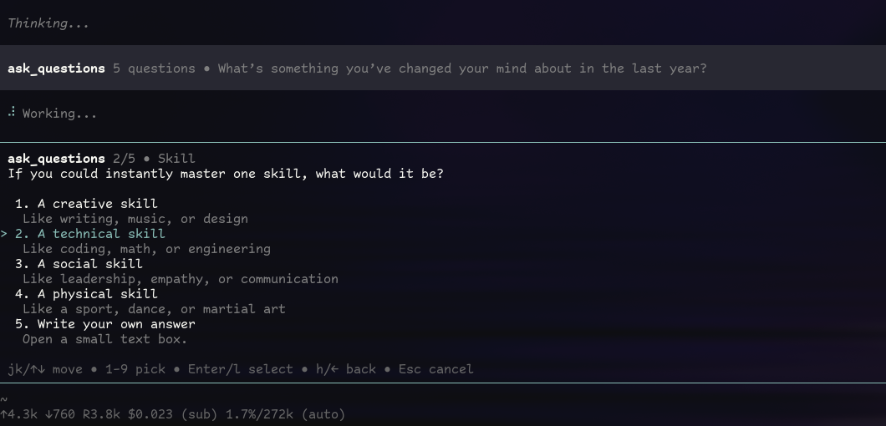

# pi-questions

[](https://www.npmjs.com/package/pi-questions)

Minimal Pi package that adds a structured `ask_questions` tool.

## Install

```bash
pi install npm:pi-questions
```

For local development in this repo:

```bash
bun install
```

This repo also includes a project-local extension wrapper at `.pi/extensions/ask-questions.ts`, so Pi can pick it up and hot-reload it with `/reload` while you work here.

## Version

- npm: [`pi-questions`](https://www.npmjs.com/package/pi-questions)
- source: [`drsh4dow/pi-questions`](https://github.com/drsh4dow/pi-questions)

## Why use this?

Use `ask_questions` when Pi should stop guessing and ask the user directly.

- clarifies requirements before locking a plan
- gathers preferences and constraints in one batch
- keeps planning/implementation grounded in explicit user input
- works better than scattering free-form clarification questions through chat
- stays fast and keyboard-driven inside the TUI

## Demo / screenshot

`ask_questions` running inside Pi's interactive TUI:



## What it does

- asks one or more structured questions in Pi's interactive TUI
- keeps the flow tight: `j/k` or arrows move, `h` goes back, `Enter` selects, `Esc` cancels
- supports single-choice options plus an optional custom answer
- uses a final review step for multi-question runs
- returns graceful non-error results for cancel and non-interactive sessions
- documents the extension code with TSDoc comments for quick maintenance

## Package shape

The package exposes the extension via `package.json`:

```json
{
  "pi": {
    "extensions": ["./extensions/ask-questions.ts"]
  }
}
```

## Tool shape

`ask_questions` accepts a small ordered list of questions. Each question has:

- `question`: full prompt shown to the user
- `header?`: short review/progress label
- `options`: short concrete choices
- `allowCustom?`: whether to add `Write your own answer`

Example:

```ts
{
  questions: [
    {
      header: "Stack",
      question: "Which stack should we use?",
      options: [
        { label: "Bun + TypeScript (Recommended)", description: "Smallest path" },
        { label: "Node + TypeScript", description: "Use the more common runtime" }
      ]
    }
  ]
}
```
